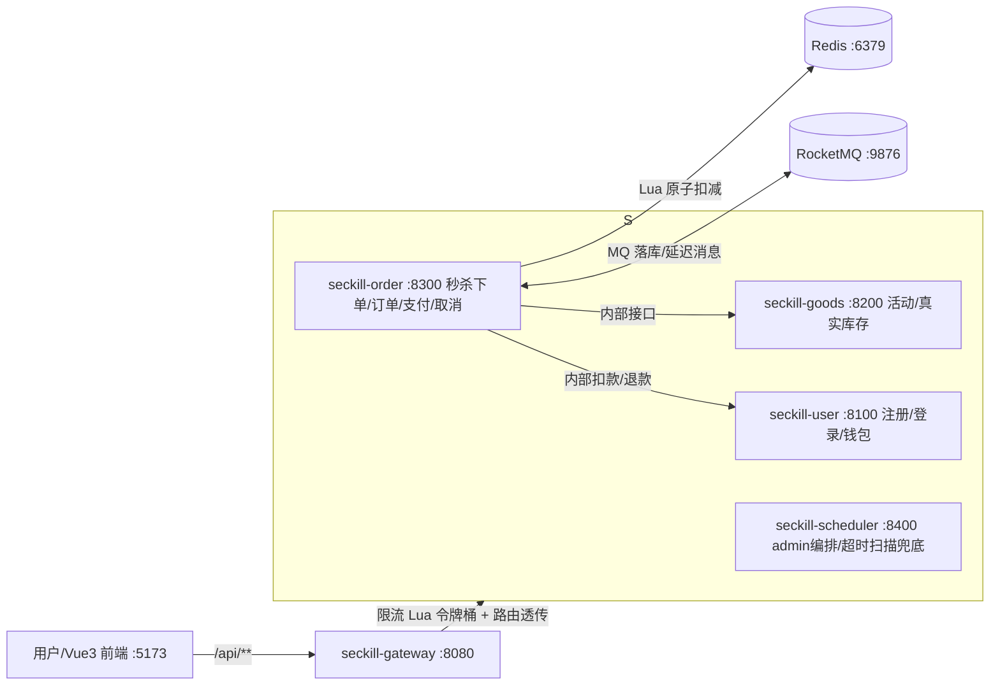

# 新果商城 · SecKill-Plus 闪购秒杀系统

微服务版限时秒杀系统，模拟电商「超级闪购节·数码3C专场」：限时、限量、限价、整点开抢。
核心解决三类工程问题：**防超卖**、**高并发削峰（限流+排队）**、**防恶意刷单**。

完整业务/接口/验收依据见《[秒杀系统_SecKill-Plus_需求文档.md](秒杀系统_SecKill-Plus_需求文档.md)》（本文档是运行与部署手册）。

---

## 1. 技术栈

| 组件 | 选型 | 版本 |
| ---- | ---- | ---- |
| 语言/框架 | Java + Spring Boot | Java 17，Spring Boot 3.2.5 |
| 构建 | Maven（多模块） | 3.9.9 |
| 缓存 | Redis | 本机 3.2.100（向下兼容 7.x 语义） |
| 消息队列 | RocketMQ | 5.5.1 |
| 数据库 | MySQL（三库独立） | 8.0.31 |
| ORM | MyBatis-Plus | 3.5.5 |
| 鉴权 | Sa-Token + sa-token-dao-redis（共享会话） | 1.37.0 |
| 限流 | Redis+Lua 分布式令牌桶（网关层） | - |
| 前端 | Vue3 + Vite + Element Plus | Node v22 |

---

## 2. 架构总览



- 唯一公网入口为 **gateway:8080**，按前缀路由：`/api/user/**`→8100、`/api/goods/**`→8200、`/api/seckill`、`/api/order/**`→8300、`/api/admin/**`→8400。
- `/internal/**` 内部接口**不暴露公网**（gateway 拦截 403），仅服务间 HTTP 静态端口直连。
- 数据库独立分库：`seckill_user` / `seckill_goods` / `seckill_order`。

### 服务清单

| 模块 | 端口 | 职责 | 内置任务 |
| ---- | ---- | ---- | ---- |
| seckill-gateway | 8080 | 分布式限流（Redis+Lua 令牌桶）+ 路由透传 + CORS | - |
| seckill-user | 8100 | 注册/登录/登出/钱包余额/模拟充值/内部条件扣款与补偿退款 | 注册时建钱包 |
| seckill-goods | 8200 | 活动管理/查询、真实库存扣减与回补（乐观锁）、Redis 预热 | ActivityStatusTask、StockPreheatTask |
| seckill-order | 8300 | 秒杀下单（Lua+MQ）、订单查询/支付/取消、MQ 生产与消费、链路日志 | OrderTimeoutConsumer |
| seckill-scheduler | 8400 | admin（建活动/查日志）转发、超时扫描兜底 | OrderTimeoutScanTask |
| seckill-web | 5173 | Vue3 用户端 + 运营端，dev 代理 `/api`→8080 | - |

---

## 3. 核心设计要点

| 关注点 | 方案 |
| ---- | ---- |
| **防超卖（第一道闸）** | Redis Lua 脚本原子完成「用户去重检查 + 库存扣减 + 已购标记」，返回 -1/-2/1 |
| **防超卖（最终兜底）** | goods 库 `t_goods_stock` 乐观锁（version 冲突重试 3 次）；订单落库时扣减、取消时回补 |
| **防重复下单** | Redis 已购标记 + DB 部分唯一索引 `uk_user_active(user_id, active_activity_id)` 双重保证 |
| **重抢（R5）** | `active_activity_id` 为 generated column：取消态(status=2/3)为 NULL，不占唯一索引 → 可重抢 |
| **削峰排队（R3）** | 秒杀命中 Lua 后立即返回 QUEUED（订单号），落库由 MQ 异步完成 |
| **限流（R7③）** | 网关层 Redis+Lua 令牌桶，按 IP+接口（纯数字路径归一化）限流，默认 `qps=200`，超限返回 4290 |
| **两阶段支付** | 先调 user 条件扣款（`balance>=amount`）→ 本地置已支付 → 失败调 refund 补偿（幂等：type=3 流水去重） |
| **超时取消（双机制）** | MQ 30 分钟延迟消息 + scheduler 每分钟扫描兜底；取消回滚 Redis/DB 库存并删已购标记 |
| **Redis 恢复（R8）** | StockPreheatTask 以 **DB `total_stock` 为准**、`setIfAbsent` 只在 key 缺失时重建（绝不用活动原始 stock，防超卖）；库存 key 带 TTL（活动结束+1天） |
| **鉴权（R7①）** | Sa-Token Redis 共享会话，各服务业务层校验，未登录 401 |

### 关键状态机（订单）

```
QUEUED（排队中，Redis 已扣）─ MQ 落库 → 0 待支付 ─┬─ 支付成功 → 1 已支付（终态）
                                                 ├─ 30 分钟未支付 → 2 已取消（超时，回滚库存）
                                                 └─ 用户主动取消 → 3 已取消（回滚库存）
```

---

## 4. 目录结构

```
seckill-plus/
├── pom.xml                       # Maven 父工程
├── seckill-common/               # 公共库（统一响应/异常/Redis Key 常量/订单号）
├── seckill-gateway/              # 网关（限流 + 路由）
├── seckill-user/                 # 用户/钱包服务
├── seckill-goods/                # 活动/真实库存服务
├── seckill-order/                # 秒杀核心服务（Lua+MQ+支付/取消）
├── seckill-scheduler/            # admin 编排 + 超时扫描
├── seckill-web/                  # 前端工程（Vue3）
├── sql/                          # 三库 DDL + 种子数据
│   ├── schema_user.sql / schema_goods.sql / schema_order.sql / seed.sql
└── scripts/                      # 构建/建库/启动脚本
    ├── build.ps1 / init-db.ps1 / start-redis.ps1 / start-rocketmq.ps1 / run-service.ps1
```

---

## 5. 快速启动（Windows / PowerShell）

> 前置依赖路径（按本机约定，脚本内已硬编码）：
> - JDK17：`D:\JDK-17`
> - Redis：`D:\Redis-x64-3.2.100\redis-server.exe`
> - RocketMQ：`D:\rocketmq\rocketmq-all-5.5.1-bin-release`
> - MySQL：账号 `root`，口令**不入库**（见下方「数据库口令配置」）
> - Node：v22（前端构建）

### 5.1 数据库口令配置（口令绝不进 git）

`user/goods/order` 三个服务的 `application.yml` 中 `spring.datasource.password` 一律是占位符
`${SECKILL_DB_PASSWORD}`（**无明文默认值**），口令按场景提供：

- **本机开发/测试**：仓库目录下留存 `src/main/resources/application-local.yml`（含 `spring.datasource.password` 的本机口令），
  该文件已被 `.gitignore` 忽略；`application.yml` 声明 `spring.profiles.default: local`，本地启动零配置即生效。
- **服务器/CI 部署**：注入环境变量 `SECKILL_DB_PASSWORD=xxxx`（优先级高于 profile 文件），无需 local 文件。
- **集成测试**：测试类声明 `@ActiveProfiles({"test","local"})`，本机直接读取同一 local 文件；CI 无该文件时依赖环境变量。
- 首次 clone 后的准备动作：手动创建上述 `application-local.yml`（模板如下，口令自填，勿提交）。

```yaml
# seckill-user/src/main/resources/application-local.yml（同名文件在 goods/order 各一份）
spring:
  datasource:
    password: <你的数据库口令>
```

```powershell
# 1) 中间件（幂等，已运行会自动跳过）
powershell -ExecutionPolicy Bypass -File scripts\start-redis.ps1
powershell -ExecutionPolicy Bypass -File scripts\start-rocketmq.ps1

# 2) 初始化三个数据库并灌种子数据（会重建表结构，仅限演示环境；口令走环境变量，不入库）
$env:SECKILL_DB_PASSWORD='<你的数据库口令>'
powershell -ExecutionPolicy Bypass -File scripts\init-db.ps1

# 3) 构建（JDK17 + 项目内 .mvn-repo）
powershell -ExecutionPolicy Bypass -File scripts\build.ps1
# 或全量测试 + 打包：
$env:JAVA_HOME="D:\JDK-17"; $env:Path="D:\JDK-17\bin;"+$env:Path
mvn -B test
mvn -B package -DskipTests

# 4) 按依赖顺序启动服务（goods → user → order → scheduler → gateway）
powershell -ExecutionPolicy Bypass -File scripts\run-service.ps1 goods
powershell -ExecutionPolicy Bypass -File scripts\run-service.ps1 user
powershell -ExecutionPolicy Bypass -File scripts\run-service.ps1 order
powershell -ExecutionPolicy Bypass -File scripts\run-service.ps1 scheduler
powershell -ExecutionPolicy Bypass -File scripts\run-service.ps1 gateway

# 5) 前端（dev 模式，代理 /api → gateway:8080）
cd seckill-web
npm install
npm run dev        # http://localhost:5173
```

> 限流默认 `seckill.ratelimit.qps=200`（单 IP）；高并发压测时可临时调高：
> `$env:SECKILL_RATELIMIT_QPS="5000"` 后再启动 gateway。读接口（列表/详情）不限流。

---

## 6. 演示账号与种子数据

| 账号 | 密码 | 角色 |
| ---- | ---- | ---- |
| user_demo | 123456 | 普通用户（钱包 5000） |
| ops_demo | 123456 | 运营（钱包 10000） |
| admin_demo | 123456 | 管理员（钱包 10000） |

种子 **5 个场次活动**（1001~1005，无线蓝牙耳机 / 智能手机 / 智能手表 / 机械键盘 / 便携充电宝），
`seed.sql` 用 `NOW()+INTERVAL` 相对时间生成，初始化后 1 分钟首场开抢。

---

## 7. 主要接口速览（统一经 gateway，`Authorization: Bearer {token}`）

| 接口 | 说明 |
| ---- | ---- |
| `POST /api/user/register` / `login` / `logout` | 注册（自动建钱包）/ 登录 / 登出 |
| `GET /api/goods/activity/list?status=&page=&size=` | 活动列表（游客可看，stock 为 Redis 实时值） |
| `GET /api/goods/activity/{id}` | 活动详情（缓存 + 回填，随机 TTL 防雪崩） |
| `POST /api/seckill/do/{activityId}` | **秒杀下单**：0 QUEUED / 4001 / 4002 / 4003 / 4290 / 401 |
| `GET /api/order/status/{orderNo}` | 订单状态轮询（未落库返回 QUEUED） |
| `GET /api/order/list?status=&page=&size=` | 我的订单 |
| `POST /api/order/pay/{orderNo}` | 钱包支付（两阶段）4004/4005/4006/4007 |
| `POST /api/order/cancel/{orderNo}` | 主动取消（仅待支付） |
| `GET /api/user/wallet/balance` / `POST /api/user/wallet/recharge` | 余额 / 模拟充值 |
| `POST /api/admin/activity` | 运营建活动（转发 goods，含初始化与预热） |
| `GET /api/admin/log?activityId=&page=&size=` | 秒杀链路日志（`data={list,total}`） |

前端页面：频道 Channel → 活动详情 → 秒杀结果（轮询） → 订单 Orders → 钱包 Wallet → 登录；运营端：AdminActivity（建活动）、AdminLog（查日志）。

---

## 8. 测试与压测

- 全量单测/集成测试：`mvn -B test`（grep `Tests run:` 汇总），覆盖 Lua 扣减、限流、乐观锁、条件扣款、
  部分唯一索引、两阶段支付补偿、超时取消幂等、MQ 消费死循环防护等。
- 并发压测脚本在 `scripts-压测/`（Python `threading`）：
  - `tools_pressure_prepare.py`：批量注册压测用户并导出 tokens
  - `pressure_seckill.py`：N 并发秒杀，统计 code 分布 + 延迟
  - `pressure_edge.py`：边界验证（401 / 4002 / 取消 / 重抢 / 支付 / 4006 / 缓存回填）

**实测记录（活动 69202，库存 100，1000 并发）**：`code0:100 / 4001:900`，avg_qps≈200，avg_lat≈3896.9ms，
Redis 终值 = DB `total_stock` = 0，无超卖。

---

## 9. 验收对照（需 求文档第 14 节清单）

| 项 | 实现状态 |
| ---- | ---- |
| 100 库存 1000 并发恰好 100 单、不超卖 | ✅ 已实现（运行证据见上） |
| 重复点击只生成 1 个非取消态订单 | ✅ 已实现（Redis 标记 + 部分唯一索引） |
| 钱包两阶段支付链路 + 补偿退款 | ✅ 已实现（补偿退款幂等） |
| 超时/主动取消回滚库存 + 可重抢 | ✅ 已实现 |
| 5 服务 + 前端本地跑通 | ✅ 已实现（scripts 一键脚本） |
| 用户端 + 运营端前端可用 | ✅ 已实现 |
| 链路日志清晰可查 | ✅ 已实现（`/api/admin/log`） |
| JMeter 压测数据 | ⚠️ 部分实现（以 Python 并发脚本替代，尚未产出 JMeter 报告） |
| 未登录/越权拦截 401/4005 | ✅ 已实现 |
| 可选：预约提醒 / 布隆过滤器 / 对账任务 / Knife4j | ⬜ 未实现（需求允许保持未勾选） |

---

## 10. 已知约束与注意事项

1. **订单号单进程唯一**：`OrderNoGenerator` 为进程静态计数器，多实例部署前必须先升级生成器（实例ID+时钟），禁止直接多进程共用。
2. **活动表 stock 只是预热值**：`t_seckill_activity.stock` 是预售总库存，仅创建时预热用；运行期间一切以 `t_goods_stock.total_stock` 与 Redis 实时库存为准（R8）。
3. **`init-db.ps1` 会重建三库表结构**，仅限演示环境，勿对生产执行。
4. **内部接口** `/internal/**` 无业务鉴权（gateway 已封闭），仅限内网服务直连，勿暴露到公网。
5. **限流按 IP**（无前向代理，`remoteAddr` 即客户端）；部署到反向代理后需改取 `X-Forwarded-For`。
6. **Maven 仓库重定向**到项目内 `.mvn-repo`（沙箱约束），网络抖动时请先检查该目录。